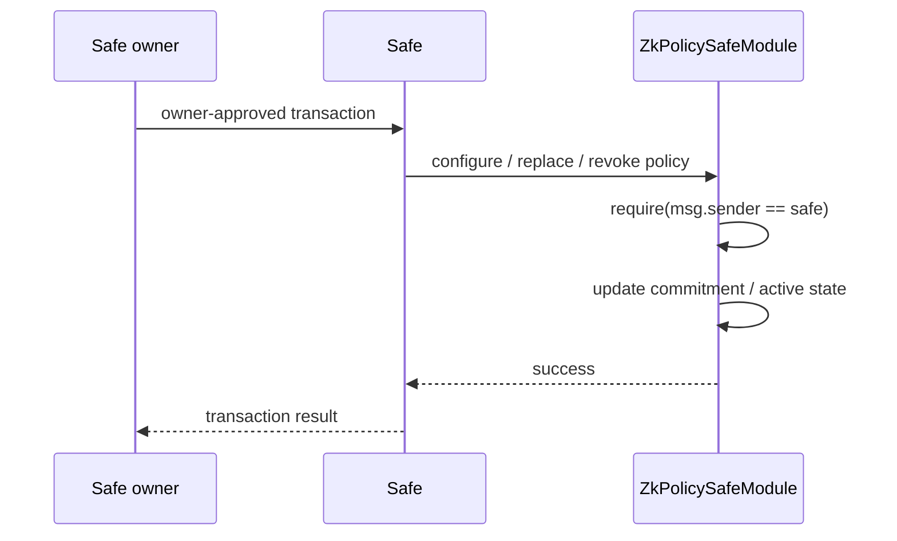

# Safe Module design

この文書は ADR 0002 を実装へ落とすための境界を定義する。Safe release と ModuleManager API は [ADR 0004](../decisions/0004-pin-safe-v1.4.1.md)（`v1.4.1`）で固定済み。module 上の policy API は `configurePolicy` / `replacePolicy` / `revokePolicy`（いずれも `msg.sender` が Safe であること）と `executeWithPolicy`（任意 caller）。policy lifecycle の nonce は [ADR 0005](../decisions/0005-invalidate-proofs-on-policy-lifecycle-changes.md) に従って単調増加させる。replace と revoke は nonce を進め、revoke 後の再設定でも reset しない。

## 役割

`ZkPolicySafeModule` は custody wallet ではない。Safe が資金を保有し、module は proof が成功した operation だけを Safe module API に渡す。

```text
Safe owner transaction -> configure / replace / revoke policy
agent or relayer      -> submit proof + bound operation
module                -> validate binding + verify proof
Safe                  -> execute the permitted operation
```

## Policy の設定・revoke



agent、relayer、任意 EOA はこの経路を呼び出せない。Safe 側の enable／disable は ADR 0004 の ModuleManager API に従う。我々の module 上の configure／replace／revoke の具体的な関数名と emergency revoke の方式は follow-up ADR で固定する。

## 必要な状態

Safe ごとに以下を管理する。

- active policy commitment
- next nonce
- configuration が active かどうか

nonce は Safe/module pair の生存期間を通じて減少させない。初回設定は 0、proof の実行、policy の置換、revoke でそれぞれ進める。これにより同じ commitment へ戻した場合でも、変更前に発行された proof を再び有効にしない。

policy の設定と revoke は `msg.sender == safe` を要求し、Safe owner が承認した Safe transaction によってのみ到達可能にする。module caller は agent、relayer、任意 EOA でよいが、policy を変更する権限は持たない。

## execute の順序

1. Safe と policy configuration が有効であることを確認する。
2. public input 数と commitment、chain ID、Safe（`account == safe`）、target、value、calldata hash、nonce、expiry を operation と照合する。[policy-spec](policy-spec.md) の初版では `data` は空、`operation` は `Call` のみ（operation は public input ではない）。
3. `block.timestamp` と expiry を照合する。
4. UltraHonk verifier を呼ぶ。
5. nonce を進め、同一 transaction 内で Safe module API を呼ぶ。
6. Safe execution が失敗した場合は transaction 全体を revert し、nonce も消費しない。

## Proof 付き実行

以下は Plan 0001 の `uint256` range constraint blocker を解消し、同じ circuit / SDK / verifier で生成した proof を使う場合の経路である。

```mermaid
sequenceDiagram
    participant Agent
    participant Prover as User-controlled prover
    participant Module as ZkPolicySafeModule
    participant Verifier as HonkVerifier
    participant Safe
    participant Target

    Agent->>Prover: propose target, value, calldata
    Prover->>Prover: evaluate private policy and bind Safe context
    alt policy violation or malformed binding
        Prover-->>Agent: no proof
    else policy compliant
        Prover->>Module: executeWithPolicy(proof, publicInputs, operation)
        Module->>Module: validate commitment, Safe, chain, target, value, calldata, nonce, expiry
        Module->>Verifier: verify(proof, publicInputs)
        alt invalid proof or expired / replayed context
            Verifier-->>Module: false / revert
            Module-->>Prover: revert; Safe is not called
        else valid proof
            Verifier-->>Module: true
            Module->>Safe: execTransactionFromModule(operation)
            Safe->>Target: permitted Call
            Target-->>Safe: result
            Safe-->>Module: success
            Module-->>Prover: success; nonce consumed atomically
        end
    end
```

## 初版の制限

- native ETH transfer のみ
- empty calldata のみ
- `Call` のみ
- 1 operation ごとに 1 proof

module が任意 call、delegatecall、multisend を受けるように見えても、circuit がその意味を証明していない限り受け付けない。
